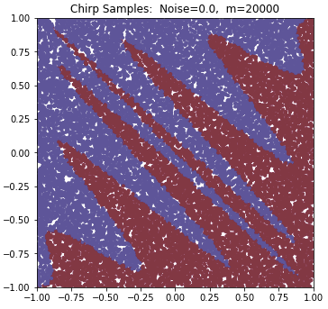
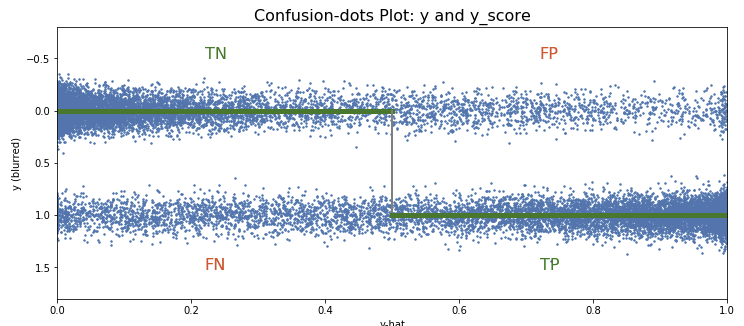
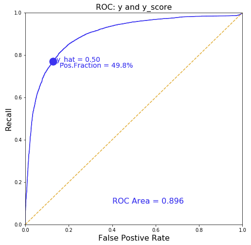

# chirp-to-ROC

<table width="100%">
	<tl>
		<td width="45%">
		
This repository provides chirp_roc_lib.py
		which has i) a 2D chirp-boundary data generator, and
		ii) a routine to compare the actual and model-generated
		y values by making a "Confusion-Dots plot" and the usual
		ROC plot.

		
For fun, the jupyter notebook has several types of ML classifier
			models and uses them to make predictions based on a noisy training
			sample from the chirp.
			These predictions are evaluated using a test sample (large and
			similarly noisy) to show some of the characteristics of the
			different models. 
		</td>
		<td> </td>
	</tl>
</table>

For fun, the jupyter notebook has several types of ML classifier models
and uses them to make predictions based on a noisy training sample
from the chirp.
These predictions are evaluated using a test sample (large and similarly noisy)
to show some of the characteristics of the different models. 

The models shown are:

- The Known Chirp model.

- A Random model.

- A Really Simple model.

- Logistic Regression.

- A Decision Tree model.

- SVM with Polynomial Features (degree=7)

- SVM using a Kernel (poly, degree=15)

- Neural Network (2 hidden layers, no regularization)

- Neural Network (2 hidden layers with L2 regularization)

The Neural Network model used here comes from Andrew Ng's
Deep Learning course, specifically from the Regularization excersize
in [Week 1 of Course 2](https://www.coursera.org/learn/deep-neural-network).
A model with 2 hidden layers and L2 regularization is implemented there;
the file reg_utils_dd.py here is modified from the course's reg_utils.py.

To Do:

