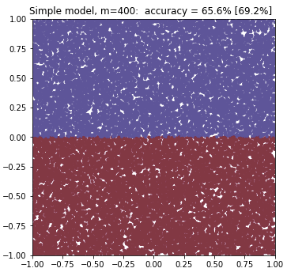

# chirp-to-ROC

Demonstrate binary classification starting with a 2D chirp-boundary
data set and ending with confusion-dots and ROC plots.

<table width="100%">
	<tr>
		<td width="45%">
		
This repository provides chirp_roc_lib.py
		which has i) a 2D chirp-boundary data generator (above), and
		ii) a routine to compare the actual (y) and model-generated
		(y_hat) values by making a "Confusion-Dots plot" and the usual
		ROC plot (at right).

		
For fun, the jupyter notebook has several types of ML classifier
			models and uses them to make predictions based on a noisy training
			sample from the chirp.
			These predictions are evaluated using a test sample (large and
			similarly noisy) to show some of the characteristics of the
			different models.

		</td>
		<td>  
			The confusion-dots plot, above, is a visual analog of the usual confusion matrix and is related to the ROC plot, below. 
			Both of these are from a neural network trained on chirp data. 
			</td>
	</tr>
</table>

The models in the notebook are listed here with their Test and [Training]
accuracies   (these will vary for different random training samples):

1- 87.5% [86.5%] The Known Chirp model. <em>Just about the best that
any model can do, indicates the Bayes limit.</em>

2- 49.6% [52.7%] A Random model. <em>Random guessing gives ~ 50% for the 
chirp here.</em>

3- 65.6% [69.2%] A Really Simple model. <em>Looks like more blue in top half,
so try that...</em>

4- 74.5% [75.0%] Logistic Regression. <em>A simple linear boundary is ok; test-% and training-% are similar, an under-fitting model.</em>

5- 72.6% [79.2%] Decision Tree model. <em>The training data are over-fitted
by a poorly-shaped (although cute) model...</em>

6- 74.7% [80.0%] SVM with Polynomial Features (deg=7) <em>Some
overfitting but a reasonable model shape.</em>

7- 75.1% [90.2%] SVM using a Kernel (poly, deg=15) <em>This SVM has the flexibility to fit the training data beyond the Bayes limit.</em>

8- 79.5% [96.2%] Neural Network (hidden=[40,9], no regularization)
<em> Finally a model is breaking the ~ 75% accuracy level; note the extreme
training over-fitting!</em>

9- 82.1% [90.2%] Neural Network (hidden=[40,9] with L2 regularization)
<em>L2 regularization has tamed the over-fitting and improved the test
accuracy.</em>

Models 4 - 7 are based on the book and repo
[Hands on Machine Learning](https://github.com/ageron/handson-ml)
by Aurelien Geron.

The Neural Network model used here comes from Andrew Ng's
Deep Learning course, specifically from the Regularization excersize
in [Week 1 of Course 2](https://www.coursera.org/learn/deep-neural-network).
A model with 2 hidden layers and L2 regularization is implemented in
the file reg_utils_dd.py here,
which is modified from the course's reg_utils.py.

- - -

Images of the Trained Models Classifying the Test Data 

<table>
	<tr>
		<td></td>
		<td></td>
		<td></td>
	</tr>
	<tr>
		<td></td>
		<td></td>
		<td></td>
	</tr>
	<tr>
		<td></td>
		<td></td>
		<td></td>
	</tr>
</table>
- - -